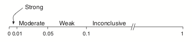
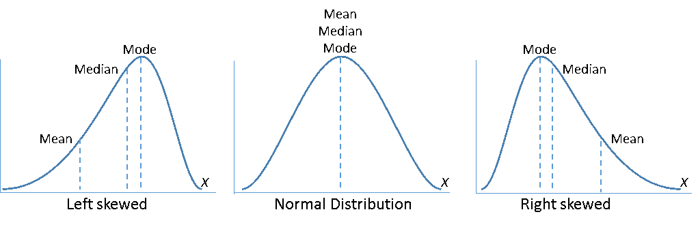
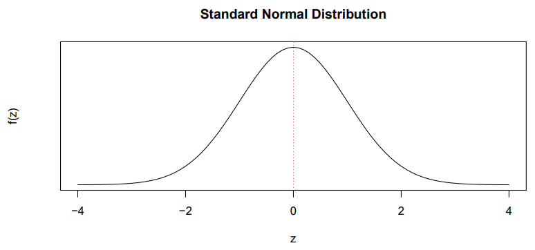
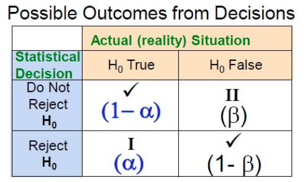

```{r, include = FALSE}
knitr::opts_chunk$set(
  collapse = TRUE,
  comment = "#>"
)
```

```{r setup}
library(stat1201)
library(lattice)
```

## 01 - Intro

### Sources of Variability

- Natural Variability
  - Something that we expect to be different such as the height of a person

- Measurement Variability
  - Differences in how people measure a certain thing

### Diffrent Types of Variables

#### Quantitative  

Numerical value the represents measurements.

- Discrete
  - Variable that can have only whole counting numbers (integers)
  
- Continuous
  - Variable that is measurable, can have any value over some range, includes numerical values with decimal placed and can be counting numbers.
  
#### Categorical 

Represents groups of objects with a particular characteristic.

- Nominal
  - The groups do not have an order

- Ordinal
  - The groups have an order

### Observational Study

- The researcher observes part of the population and measures the characteristics of interest
- Makes conclusions based on the observations but does not influence to change the existing conditions or does not try to affect them.
- E.g. Examine the effect of smoking on lung cancer on those who already smoke.

### Experimental Study

- The researcher assigns subjects to groups and applies some treatments to groups and the other group does not receive the treatment.
- Can be designed as blind (participants don't know what group they are in).
- Can be designed as double-blind (participants and the researcher doesn't know the groups).
- When an experiment involves both comparison and randomization we call it a randomized comparative experiment.
- E.g. Examine the effect of caffeinated drinks on blood pressure.

### Hypothesis Testing

#### Null hypothesis

- Denoted $H_0$
- A statement of no effect.
- Either reject or do not reject $H_0$
- E.g. $H_0$: Caffeinated drinks has no effect on the mean change in pulse rate among young adults

#### Alternative Hypothesis

- Denoted $H_1$
- A statement of an effect
- If we reject $H_0$ we conclude there is sufficient evidence to accept the alternative hypothesis
- E.g. $H_1$: Caffeinated drinks increase the mean change in pulse rate among young adults

#### p-value

- We use the concept of p-value to reject or do not reject the null hypothesis

\

- p < 0.01         -- Strong evidence against $H_0$
- 0.01 <= p < 0.05 -- Moderate Evidence against $H_0$
- 0.05 <= p < 0.1  -- Weak evidence against $H_0$
- p >= 0.1         -- No evidence against $H_0$

## 02 - Exploratory Data Analysis

```{R}
survey <- read.csv("data/M2Survey.csv")
```

### Central Tendency

Provides information about the center, or middle part of a quantitative variable.

#### Mode

The most frequently occurring value in a set of data.

```{R}
mode_stats(survey$Weight)
```

#### Median

The middle value in ordered data and can be used to measure the center of the distribution. 

- 50% of the observations are to the left of the median.
- If the number of observations is odd, the median is the middle number.
- If the number of observations is even, the median is the average of the two middle numbers.

```{R}
median(survey$Weight)
```

#### Mean

The average of a set of numbers.  
```{R}
mean(survey$Weight)
```

### Measures of Location

#### Percentiles

- Measures of location
- Percentiles divide a set of ranked data so that a certain fraction of data is falling on or below this location
- E.g. 10th percentile is the value such that 10% of the data is equal to or below that value.

#### Quantiles

- Are labeled between the values 0 to 1.
- 10th percentile is the same as the 0.1 quantile
```{R}
# 13th percentile
quantile(survey$Weight, probs = 0.13)
```

#### Quartiles

- Divide a set of ranked data into four subgroups of parts. ($Q_1, Q_2, Q_3$)
- $Q_1$ separates the first 25% of ranked data to its left. 
  - Same as the 25th percentile. Or 0.25 quantile.
- $Q_2$ separates the first 50% of ranked data to its left.
  - Same as the 50th percentile. Or 0.5 quantile.
  - Also the median
- $Q_3$ separates the first 75% of ranked data to its left.
  - Same as the 75th percentile. Or 0.75 quantile.

```{R}
quantile(survey$Weight, probs = c(0.25, 0.5, 0.75))
```

### Measures of Variability

The variability measures can be used to describe the spread or the dispersion of a set of data. 
The most common measures of variability are range, the interquartile range (IQR), variance and standard deviation.

#### Range

- Range = Max - Min
- Range is affected by extreme values (outliers)

```{R}
max(survey$weight) - min(survey$Weight)
```

#### Interquartile Range (IQR)

- IQR measures the distance between the first and third quartiles.
- This is the range of the middle 50% of the data
- IQR = $Q_3$ - $Q_1$
```{R}
IQR(survey$Weight)
```

#### Variance and Standard Deviation

- Considers how far each data value is from the mean
- SD is the square root of variance
- SD is the most useful and most important measure of variability.
```{R}
aggregate(Weight ~ Sex, survey, sd)
```

### Five Num Summary

Gives a compact description of a distribution including a rough picture of its shape.  
Min, $Q_1$, Median, $Q_3$, Max
```{R}
fivenum(survey$Height)
```

### Skewed Distriubtions

Skewness measures the shape of a distribution.  

**Left or Negatively skewed:** A greater number of observations occur in the left tail of the distribution (Mean < Median).  

**Right or Positively skewed:** A greater number of observations occur
in the right tail of the distribution (Mean > Median).

\

### Outliers

The causes of outliers come from different ways.

- Data entry or measurement errors
- Sampling problems and unusual conditions
- Natural variation

#### Detecting

- IQR can be used to find outliers.
- Observation < $Q_1$ - 1.5 * IQR
- Observation > $Q_3$ + 1.5 * IQR

```{R}
outliers(167, 178)
```

## 03 - Randomness and Probability

### Population Parameters Vs Sample Statistics

|            | Population Param |  Sample Stat   |
| :--------: | :--------------: | :------------: |
|    Size    |       $N$        |      $n$       |
|    Mean    |      $\mu$       | $\overline{x}$ |
|  Variance  |    $\sigma^2$    |     $s^2$      |
|     SD     |     $\sigma$     |      $s$       |
| Proportion |       $p$        |   $\hat{p}$    |

#### Sampling Error

- Sampling error is an unavoidable consequence of being able to observe only a subset of the elements in the population.
- Sampling errors can be reduced by increasing the sample size, and sometimes by using a different sampling selection approach.

### Probability

- How likely that a particular event will happen.
- Probabilities to outcomes can be assigned in three ways
  - Subjective probability (reflects on an individual's belief)
  - Calculated or theoretical probability (based on prior knowledge)
  - Empirical probability (outcome is based on observed data).

#### Key Concepts

- Sample Space ($\Omega$)
  - Set of all possible outcomes that might be observed in a random process.
- Event (A)
  - A subset of sample space. If an event occurs one of the outcomes in it occurs,
- Complement ($\overline{A}$)
  - The set of all outcomes in $\Omega$ not in A
- Union ($A \cup B$)
  - The set of all outcomes in A, or in B, or in both.
- Intersection ($A \cap B$)
  - The set of outcomes in both A and B
- If the two events are disjoint then,
  - $P(A \cup B) = P(A) + P(B)$

#### Conditional Probability

- Probability of event A occurring if B has already occurred.
- $P(A|B) = \frac{P(A \cap B)}{P(B)}$

#### Independent Events

- Two events are independent if one event occurs and it does not affect the probability of the other event occurring.
- Only if A and B are independent events the probability of A occuring, given B has already occured, will be the same as just the probability of A.

$$
\begin{aligned}
P(A|B) &= P(A) \\
P(B|A) &= P(B) \\
P(A \cap B) &= P(A) \times P(B)
\end{aligned}
$$

### Discrete Probability Distribution

- The listing of all possible values of a discrete random variable X along with their associated probabilities
- A random variable that has a countable number of possible values.
  - Usually things which are counted, and not measured.
- Example: 
```{R}
discrete_dist(0:3, c(0.21, 0.45, 0.23, 0.11))
```

#### Expected Value (Mean) and Variance

- Long run average of a random variable.
$$
\begin{aligned}
E(X) &= \mu = \sum xP(X=x) \\
Var(X) &= \sigma^2 = \sum P(X=x)(x - \mu)^2 \\
SD(X) &= \sigma = \sqrt{Var(X)}
\end{aligned}
$$

### Continuous Probability Distribution

- A random variable that takes values at every time over a given interval
  - Usually things which are measured, not counted
- Can not be presented in a table or histogram as there is an uncountable number of possible outcomes.
- The probability of any individual outcome is zero.
  - $P(X=x) = 0$
- We always calculate the probability for a range of the continuous random variable X.
  - $P(X > a)$
  - $P(a <= X <= b)$

### Expected Value and Variance of Combined Variables

- Rule 1: 
  - Suppose $X$ is a random variable and $a$ is a constant
  
$$
\begin{aligned}
Y &= aX \\
E(Y) &= aE(X)\\
Var(Y) &= a^2 Var(X)
\end{aligned}
$$

- Rule 2:
  - Suppose $X$ is a random variable and $a$ and $b$ are constants.
  
$$
\begin{aligned}
Y &= aX + b \\
E(Y) &= aE(X) + b\\
Var(Y) &= a^2 Var(X) \\
SD(Y) &= aSD(X)
\end{aligned}
$$

- Rule 3:
  - Suppose $X_1$ and $X_2$ are two independent random variables.
  
$$
\begin{aligned}
Y &= X_1 + X_2 \\
E(Y) &= E(X_1) + E(X_2)\\
Var(Y) &=  Var(X_1) + Var(X_2)
\end{aligned}
$$

- Rule 4:
  - Suppose $X_1$ and $X_2$ are two independent random variables.
  
$$
\begin{aligned}
Y &= X_1 - X_2 \\
E(Y) &= E(X_1) - E(X_2)\\
Var(Y) &=  Var(X_1) - Var(X_2)
\end{aligned}
$$

## 04 - Probability and Sampling Distributions

### Binomial Distribution

Important discrete probability distribution.  
We use the concept of Bernoulli Trial to describe the Binomial Distribution.  

- A Bernoulli Trial is a random process with only two possible outcomes.
- These outcomes are *success* and *failure*
- Let X be the number of successes from n number of independent Bernoulli trials and P(Success) = p.
- X has a Binomial distribution with parameters $n$ and $p$
  - X ~ Binom($n$, $p$)

#### Mean and SD of X

$$
\begin{aligned}
X &\sim Binom(n, p) \\
E(X) &= np \\
Var(X) &= np(1-p) \\
SD(X) &= \sqrt{Var(X)}
\end{aligned}
$$

#### Example

```{R}
# Let X be the number of lizards whose length is above the mean. (60%)
n <- 5
p <- 0.6
# Then X ~ Binom(5, 0.6)

# P(X=2)
dbinom(2, 5, 0.6)

# P(X < 2)
sum(dbinom(0:1, 5, 0.6))

# P(X >= 2) == 1 - P(X < 2)
1 - sum(dbinom(0:1, 5, 0.6))

binom_dist(5, 0.6)
```

### Normal Distribution

- Also called Gaussian Distribution
- Normal Distribution is a continuous probability distribution with two parameters, $\mu$ and $\sigma$
- Let X be a continuous random variable. If X has a Normal distribution we can write,
  - X ~ Normal($\mu, \sigma$)
- Bell shaped and symmetrical about $\mu$
- Location is determined by $\mu$
- Spread is determined by $\sigma$
- The random variable X has an infinite theoretical range ($-\infty$ to $+\infty$).

#### Probability Calculations

- The area under the Normal density curve is 1.
- Rough rule to calculate the areas.
  - Within 1 SD of the mean is 68%
  - Within 2 SD of the mean is 95%
  - Within 3 SD of the mean is 99.7%
- We Transform the Normal Distribution to a Standard Normal Distribution.
  - If X ~ Normal($\mu, \sigma$)
  - Then $Z = \frac{X - \mu}{\sigma}$
  - and Z ~ Normal(0, 1)

\


### Sampling Distribution of the Sample Mean

- The distribution of all possible sample means using the same sample size, selected from a population.
- Suppose we have a population of 1000 people's heights.
  - $\mu =  162.1504$
  - $\sigma = 8.147348$
- We can then take 20 samples each of size n from the population
- We can treat the sample means ($\overline{X}$) as a random variable and calculate the mean and the standard deviation of the 20 sample means.

| Sample Size (n) | E($\overline{X}$) | sd($\overline{X}$) |
| :-------------: | :---------------: | :----------------: |
|        4        |      161.95       |       4.619        |
|       16        |      162.55       |       2.095        |
|       25        |      162.53       |       1.521        |
|       100       |      162.36       |       0.780        |

- We can observe that the mean of the sample means closes in on the population mean.
- The standard deviation of the sample means becomes smaller.
- The ratio of the standard deviation of the sample means to the population standard deviation is $\frac{1}{\sqrt{n}}$
- If the population is normally distributed, the sampling distribution of the sample means ($\overline{X}$) is normally distributed.
- Therefore the distribution of $\overline{X}$ can be summarized as follows:
$$
\begin{aligned}
E(\overline{X}) &= \mu \\
Var(\overline{X}) &= \frac{\sigma^2}{n} \\
sd(\overline{X}) &= \frac{\sigma}{\sqrt{n}} \\
\therefore \overline{X} &\sim Norm(\mu, \frac{\sigma}{\sqrt{n}})
\end{aligned}
$$

#### Central Limit Theorem

- As the sample size increases, the sampling distribution of the sample means becomes approximately normally distributed regardless of the shape of the population variable distribution


#### Example

```{R}
sampling_dist_mean(50, 8, 4)
```

### Sampling Distribution of the Sample Proportions

- The sample proportion ($\hat{p}$)
- Define $p$ as the population proportion of students whose height is less than or equal to 155cm
- $\hat{p} = \frac{x}{n}$ where x is the number of students in the sample whose height is less than or equal to 155cm
- Provided that $n$ is large such that $np > 5$ and $n(1 - p) > 5$ we can show that,
$$
\begin{aligned}
E(\hat{p}) &= p \\
sd(\hat{p}) &= \sqrt{\frac{p(1-p)}{n}} \\
\therefore \hat{p} &\sim Norm(p, \sqrt{\frac{p(1-p)}{n}}) \\
\\
Z &= \frac{\hat{p} - p}{\sqrt{\frac{p(1-p)}{n}}} \\
Z &\sim Norm(0, 1) \\
\end{aligned}
$$

#### Example

```{R}
sampling_dist_prop(0.1, 10)
```

## 05 - Statistical Inference

Process of drawing conclusions about the population parameters and the 
reliability of statistical relationships based on sample information.

### Confidence Interval (CI)

- The CI is a range of values that is likely to include the population parameter with a certain level of confidence.
- Has a lower limit (LL) and an upper limit (UL)
  - $LL <= \mu <= UL$
- Takes into consideration the variation in sample statistics from sample to sample.
- Level of Confidence (LOC)
  - How confident you will be the interval contain the unknown population parameter. 
  - LOC is always less than 100%

$$
\begin{aligned}
\overline{X} &\pm MOE \\
LL &= \overline{X} - MOE\\
UL &= \overline{X} + MOE\\
MOE &= \frac{UL - LL}{2}\\
MOE &= crit \times se
\end{aligned}
$$

### Student's t Distribution

- $t$ values are calculated from sample size of $n$, will have the $t(n-1)$ distribution.
- $(n - 1)$ is called the degrees of freedom of the t-distribution

$$
\begin{aligned}
T &\sim t(n-1)\\
T &= \frac{\overline{X}-\mu}{\frac{s}{\sqrt{n}}}\\
\overline{X} &\pm t_{(n-1)}^* \frac{s}{\sqrt{n}} 
\end{aligned}
$$
- $t_{(n-1)}^*$ is the number of standard errors required for the desired level of confidence in the $t_{(n-1)}$ distribution

### Choosing Sample Size

- Always ceil the result as the MOE must be less than or equal to the specified value

$$
\begin{aligned}
MOE &= Z^* \frac{\sigma}{\sqrt{n}}\\
\therefore n &= \left(\frac{Z^* \sigma}{MOE} \right)^2
\end{aligned}
$$

### One Sample t-test

- Case 1
  - $H_0 : \mu = \mu_0$
  - $H_1 : \mu \neq \mu_0$

- Case 2
  - $H_0 : \mu = \mu_0$
  - $H_1 : \mu > \mu_0$

- Case 3
  - $H_0 : \mu = \mu_0$
  - $H_1 : \mu < \mu_0$

$$
\begin{aligned}
df &= n - 1 \\
se(\overline{X}) &= \frac{s}{\sqrt{n}} \\
t_{stat} &= \frac{\overline{X} - \mu_0}{se(\overline{X})}\\
\overline{X}&\pm t^*\times se(\overline{X})
\end{aligned}
$$

#### Example

```{R}
one_sample_t(60.8, 10.91, 20, mu = 55)

one_sample_assumptions()
```

### Types of Errors

\

- Probability of making Type I and II errors are both conditional probabilities
- Not able to make both errors at the same time.
- Increasing $\alpha$ will decrease $\beta$

#### Power of the Hypothesis Tet

- Statistical power, or the power of a hypothesis test is the probability
that the test correctly rejects the false null hypothesis
- Power(1 - $\beta$) = P(Reject $H_0$ | $H_0$ is false)
- Increasing sample size makes the hypothesis test more sensitive.
  - More likely to reject $H_0$ when it is false.
  - Increases the power of the test
  
#### Statistical Power Analysis

- Low statistical power = Large risk of committing type II errors
- High statistical power = Small risk of committing type II errors
- Experimental results with too low statistical power will lead to
invalid conclusion


## 07 - Comparing Two Populations

### Two Sample t-test

Hypothesis test to compare the means of two independent populations using t-distribution.

```{R}
two_sample_assumptions()
```

- Case 1
  - $H_0 : \mu_1 = \mu_2$
  - $H_1 : \mu_1 \neq \mu_2$

- Case 2
  - $H_0 : \mu_1 = \mu_2$
  - $H_1 : \mu > \mu_0$

- Case 3
  - $H_0 : \mu_1 = \mu_2$
  - $H_1 : \mu_1 < \mu_2$

Two ways of doing a two sample t-test:

1. Assume that unknown population standard deviations are not equal
    - $\sigma_1 \neq \sigma_2$
2. Assume that unknown population standard deviations are equal
    - $\sigma_1 = \sigma_2$
    - Pooled t-test

#### SD's Not Equal

$$
\begin{aligned}
df &= min(n_1 - 1,\ n_2 - 1) \\
se(\overline{X_1} - \overline{X_2}) &= \sqrt{\frac{s_1^2}{n_1} + \frac{s_2^2}{n_2}}\\
t_{stat} &= \frac{(\overline{X_1} - \overline{X_2})-(\mu_1 - \mu_2)}{se(\overline{X_1} - \overline{X_2})}\\
(\overline{X_1} - \overline{X_2})&\pm t^*\times se(\overline{X_1} - \overline{X_2})
\end{aligned}
$$

##### Example

```{R}
two_sample_t(26.18, 7.29, 10, 50.19, 17.91, 10)

## Welch t-test
breath <- read.csv("data/Breath.csv")
t.test(BreathHeld ~ Sex, data = breath, alternative = "less")
```

#### SD's Equal (Pooled t-test)

- $S_p^2$ is the pooled variance
- $\sqrt{S_p^2}$ is the pooled standard deviation

$$
\begin{aligned}
df &= n_1 + n_2 -2 \\
S_p^2 &= \frac{s_1^2(n_1 - 1) + s_2^2(n_2 - 1)}{(n_1 - 1) + (n_2 - 1)} \\
se(\overline{X_1} - \overline{X_2}) &= \sqrt{S_p^2\left(\frac{1}{n_1} + \frac{1}{n_2}\right)} \\
t_{stat} &= \frac{(\overline{X_1} - \overline{X_2}) - (\mu_1 - \mu_2)}{se(\overline{X_1} - \overline{X_2})} \\
(\overline{X_1} - \overline{X_2})&\pm t^*\times se(\overline{X_1} - \overline{X_2})
\end{aligned}
$$

##### Example

```{R}
pooled_t(167.32, 6.1, 20, 172.26, 6.3, 25, tail = 1)
```


### Two Population Proportions

```{R}
two_prop_assumptions()
```
- $p_1$ and $p_2$ are unknown population proportions
- $\hat{p_1}$ and $\hat{p_1}$ are sample proportions

$$
\begin{aligned}
se(\hat{p_1} - \hat{p_2}) &= \sqrt{\frac{\hat{p_1}(1 - \hat{p_1})}{n_1} + \frac{\hat{p_2}(1 - \hat{p_2})}{n_2}} \\
Z_{stat} &= \frac{(\hat{p_1} - \hat{p_2}) - (p_1 - p_2)}{se(\hat{p_1} - \hat{p_2})} \\
(\hat{p_1} - \hat{p_2}) &\pm Z^*\times se(\hat{p_1} - \hat{p_2})
\end{aligned}
$$


#### Example

```{R}
two_prop_z(32 / 100, 100, 18 / 100, 100, tail = 1)
```

## 08 - Statistical Models

### Correlation Between Two Variables

Correlation coefficient $r$ measures the relative strength and
direction of the linear relationship between two numerical variables.

Correlation does not imply a causal effect of the two variables.

- $-1 <= r <= +1$
- $r$ close to -1 implies a strong negative linear relationship
- $r$ close to +1 implies a strong positive linear relationship
- $r$ close to 0 implies a weak linear relationship
- $r = 0$ implies no linear relationship

Define:

- $r$ is the sample correlation coefficient
- $\rho$ is the population correlation coefficient 

$$
\begin{aligned}
df &= n - 2 \\
se(r) &= \sqrt{\frac{1 - r^2}{n - 2}} \\
t_{stat} &= \sqrt{r - \rho}{se(r)} 
\end{aligned}
$$

#### Example

```{R}
# If given r value
r <- cor(breath$Height, breath$BreathHeld)
correlation_t(r, 20)

# If given data
cor.test(breath$Height, breath$BreathHeld)
```

### Simple Linear Regression 

- One dependent (or response variable): $Y$
- One independent (or explanatory variable): $X$
- A single independent variable ($X$) is used to predict the numerical dependent variable ($Y$)

Population SLR equation:

- $Y_i = \beta_0 + \beta_1 X_i + U_i$
- $\beta_0$ and $\beta_1$ are population parameters to be estimated using sample data.
- $\beta_0$ = population Y intercept
- $\beta_1$ = population slope
- $U_i$ = random error in $Y$ for observation $i$
  - $U_i \sim N(0,\sigma)$
  - $E(U_i) = 0$
  - $Var(U_i) = \sigma^2$
- Residual is also called the estimated error ($e_i$)
  - $e_i = Y_i + \hat{Y_i}$

##### Examples

```{R}
fit <- lm(BreathHeld ~ Height, data = breath)
fit

predict(fit, newdata = data.frame(Height = 160))
```

#### Measures of Variation

- How much of the variation in the dependent variable, Y is
explained by variation in the independent variable, X.

$$
\begin{aligned}
SST &= \text{Total Sum of Squares} \\
SSL &= \text{Line Sum of Squares} \\
SSR &= \text{Residual Sum of Squares} \\
SST &= SSL + SSR
R^2 &= \frac{SSL}{SST}
\end{aligned}
$$

##### Example

```{R}
summary(aov(BreathHeld ~ Height, data = breath))
SSL <- 2656
SST <- SSL + 3364
R2 <- SSL / SST
R2
# Only 44.12% of variation in breath holding time is explained by variation in height.
```

#### Inferences for the Slop Coefficient

$$
\begin{aligned}
df &= n - 2 \\
t_{stat} &= \frac{b_1 - \beta_1}{se(b_1)} \\
b_1 &\pm t^* \times se(b_1)
\end{aligned}
$$

##### Example

```{R}
slr_t(1.2774, 0.3388)

summary(lm(BreathHeld ~ Height, data = breath))
```

#### Assumptions

```{R}
lr_assumptions()
```

#### With Dummary Variables

- $Y_i = \beta_0 + \beta_1 X_i + U_i$
- $X$ is a dummy variable, which can take only two values, either 1 or 0.

```{R}
summary(lm(BreathHeld ~ Sex, data = breath))

# b1 = 30.612 implies that the mean breath holding time for males is
# 30.612 seconds higher than that of for females.
```

### Multiple Linear Regression

- $Y_i = \beta_0 + \beta_1 X_1i + beta_2 X_2i + U_i$

```{R}
# No interaction
summary(lm(BreathHeld ~ Height + Sex, data = breath))

# Interaction
summary(lm(BreathHeld ~ Height * Sex, data = breath))
```

$$
\begin{aligned}
df &= n - k - 1 \\
t_{stat} &= \frac{b_j - \beta_j}{se(b_j)} \\
\text{Adjusted } R^2 &= 1 - \left((1 - R^2)(\frac{n - 1}{n - k - 1}) \right)
\end{aligned}
$$

#### Examples

```{R}
mlr_adjusted_R2(0.78, 20, 2)

lr_assumptions()
```

## 09 - Analysis of Variance (ANOVA)

```{R}
anova_assumptions()
```

| Source                              |   df    |  SS   |             MS              |         F         |       p       |
| :---------------------------------- | :-----: | :---: | :-------------------------: | :---------------: | :-----------: |
| Independent Categorical Variable(s) | $k - 1$ | $SSG$ | $MSG = \frac{SSG}{(k - 1)}$ | $\frac{MSG}{MSR}$ | $P(F >= F^*$) |
| Residuals                           | $n - k$ | $SSR$ | $MSR = \frac{SSR}{(n - k)}$ |                   |               |
| Total                               | $n - 1$ | $SST$ | $MST = \frac{SST}{(n - 1)}$ |                   |               |

- $k$ = number of groups in the independent variable
- $n$ = sample size

To perform an ANOVA test of equality of population means, we subdivide the total variation in the values into two parts.

1. Variation between the groups
2. Variation within the groups

Total variation  = Between Group Variation + Within Group Variation

SST = SSG + SSR

### One-Way ANOVA

- One quantitative response (or dependent) variable
- One independent categorical variable

```{R}
bw <- read.csv("data/M9BirthWeight.csv")
summary(aov(BirthWeight ~ Race, data = bw))

# R^2 = SSG/SST
SSG <- 3002792
SST <- SSG + 45060356
SSG / SST
# 6.25% of variability in the birth weight is explained by the race of the mother
```

#### Normal Probability plots for Residuals

- If all plots roughly follow a linear trend thus we can assume normality of residuals.

```{R}
bw$resid <- resid(aov(BirthWeight ~ Race, data = bw))

# qqmath(subset(bw, Race == "Other")$resid, ylab = "Residuals")
# qqmath(subset(bw, Race == "White")$resid, ylab = "Residuals")
qqmath(subset(bw, Race == "Black")$resid, ylab = "Residuals")
```

#### Multiple Comparisons

- The null and alternative hypothesis in a One Way ANOVA is such that:
- $H_0 : \mu_1 = \mu_2 = ... = \mu_k$ (k = no. of groups)
- $H_1 :$ Not all $\mu_j$'s are the same.
- If $H_0$ is rejected then we should find out which population means are different.

```{R}
potato <- read.csv("data/M9Potato.csv")
summary(aov(Yield ~ Treatment, data = potato))
```

There are 4 treatment groups in "Potato". That is $k = 4$

$$
\begin{aligned}
\text{No. of pairs } &= {k \choose 2} \\
&= \frac{k!}{2!(k-2)!}\\
&= \frac{4}{2!(4 - 2)!} \\
\therefore \text{No. of pairs } &= 6
\end{aligned}
$$

#### Pairwise t-test

- Using a significance level of 5% ($\alpha = 0.05$) we reject the individual null hypothesis for each p-value that is less than 0.05.

```{R}
pairwise.t.test(potato$Yield, potato$Treatment, p.adjust.method = "none")
```

Therefore we can say $\mu_A \neq \mu_B$, $\mu_A \neq \mu_C$, $\mu_C \neq \mu_D$

#### Pairwise t-test Bonferroni Correction

- Used to contract the problem of multiple comparisons.
- We use a smaller level of significance.
  - Significance = $\frac{0.05}{q}$, where $q$ is the number of pairs
  - $\therefore \alpha = \frac{0.05}{6} = 0.0083$

```{R}
pairwise.t.test(potato$Yield, potato$Treatment, p.adjust.method = "bonferroni")
```

Now only $\mu_A \neq \mu_C$ is less than $\alpha$ (0.0083)

#### Tukey's HSD

- Bonferroni method is a little too conservative, reducing the overall power

```{R}
TukeyHSD(aov(potato$Yield ~ potato$Treatment))
```

$\mu_A \neq \mu_C$ is less than $\alpha$ (0.05)

### Two-Way ANOVA

- One quantitative response (or dependent) variable
- Two independent categorical variables

```{R}
oxy <- read.csv("data/M9Oxytocin.csv", as.is = FALSE)
oxy$change <- oxy$After - oxy$Before

table(oxy$Relationship, oxy$Stimulus)
aggregate(change ~ Stimulus * Relationship, data = oxy, mean)
```

#### Interactions Effects Plot

- If the lines are parallel, this suggests that an interaction is unlikely.

```{R}
xyplot(change ~ Stimulus,
  data = oxy, group = Relationship, type = c("p", "a"),
  auto.key = TRUE, ylab = "Change in oxytocinxlab", xlab = "Stimulus event"
)
```

#### Two-Way ANOVA

```{R}
summary(aov(change ~ Stimulus * Relationship, data = oxy))
anova_assumptions()
```

## 11 - Chi-square test and Logistic Regression

### Chi-Square Test

Commonly use to test the relationships between two categorical variables

- $f_o$ = Observed Frequency
- $f_e$ = Expected Frequency

#### Chi-Square Test for Independence

- $H_0$ : The two categorical variables are independent.
- $H_1$ : The two categorical variables are related.

$$
\begin{aligned}
f_e = \frac{RowTotal \times ColumnTotal}{GrandTotal} \\
\chi_{stat}^2 = \sum_{allcells}{\frac{(f_o - f_e)^2}{fe}}
\end{aligned}
$$

##### Example

```{R}
chisq <- chisq_indep(Nicotine = c(No = 148, Yes = 52), Placebo = c(No = 182, Yes = 18))

# Observed Frequencies
chisq$observed

# Expected Frequencies
chisq$expected

# Chi-Sqaure test for Independence
chisq

# If data use with Yates continuity correction
# chisq.test(table(inhaler$Reduction, inhaler$Inhaler)
```

#### Chi-Square Goodness of Fit Test

- Used to determine how well a set of data matches a specific probability distribution.
- Use the rule of thumb that all expected frequencies should be at least 1 and 80% of them should be at least 5
- $f_e = np$
- df = no. of categories - k - 1, where k is the number of parameters estimated.

##### 6-sided die example

- $H_0$ : The die is fair
- $H_1$ : The die is not fair
- If the die is fair then $p = 1/6$ for all $f_0$
- No parameters were estimated so $k = 0$
- $df = 6 - 0 - 1 = 5$

```{R}
chisq_gof(c(185, 190, 210, 205, 195, 215), 1 / 6)
```

### Logistic Regression

- Dependent (or response) variable is dichotomous (binary)
- The log odds of the outcome (dependent) variable is modeled as a linear combination of independent (or explanatory) variables.

#### Odds and Odds Ratio (OR)

- Odds = $\frac{p}{1 - p}$

```{R}
addmargins(chisq$observed)
```

- Define p = probability of reduction in smoking for subjects with nicotine inhaler
- $p = \frac{52}{200} = 0.26$
- Odds of reduction in smoking for subjects with nicotine inhaler:
  - $\frac{p}{1-p} = \frac{0.26}{1-0.26} = 0.3514$
- Odds for a reduction in smoking for subjects with nicotine inhaler is 0.3514 to 1

Odds for a reduction in smoking for subjects with placebo is:

```{R}
logistic_odds(18 / 200)
```

OR = $\frac{\text{Odds}_1}{\text{Odds}_2}$

```{R}
logistic_or(52 / 200, 18 / 200)
```

Based on sample data the effect of inhaler on reduction in
smoking is 3.55 times huger if someone is using a nicotine inhaler
than using placebo inhaler. This implies that nicotine inhalers are
beneficial in assisting reduction of smoking based on this sample
data. 

- Since $p$ is a probability, $0 < \text{Odds} < \infty$
- $-\infty < ln(\frac{p}{1-p}) < \infty$
- For Odds < 1, $ln(\frac{p}{1-p})$ is negative

#### Inferences

Population regression model:

- $ln(\frac{p}{1-p}) = \beta_0 + \beta_1 X$ 
- $\beta_0$ is the population intercept
- $\beta_1$ is the slope parameters

Estimated model:

- $ln(\frac{\hat{p}}{1-\hat{p}}) = b_0 + b_1 X$ 

##### Example

```{R}
lungs <- read.csv("data/M11Lungs.csv")
lungs$Cancer <- ifelse(lungs$Cancer == "Yes", 1, 0)

library(popbio)
logi.hist.plot(lungs$Cigarettes, lungs$Cancer,
  boxp = FALSE,
  ylabel = "Prob of lung cancer",
  xlabel = "No. of cigarettes smoked"
)
```

- Logistic regression fits an “S” shaped logistic function.
- The curve goes from - to 1.
- The curve tells us the probability that a person getting a lung cancer based on the number of cigarettes he had per day.

```{R}
summary(glm(Cancer ~ Cigarettes, data = lungs, family = "binomial"))
```

$$
\begin{aligned}
\hat{p} &= \frac{e^{b_0 + b_1X}}{1 + e^{b_0 + b_1X}} \\
\\
\therefore \hat{p} &= \frac{e^{-12.5974 + 0.7630X}}{1 + e^{-12.5974 + 0.7630X}}\\
\\
\text{When } X &= 15
\end{aligned}
$$

```{R}
# Estimated probability for getting lung cancer for a person who smokes 15 cigarettes per day.
phat <- logistic_phat(-12.5974, 0.7630, 15)
phat

# Odds for getting lung cancer for a person who smokes 15 cigarettes per day.
logistic_odds(phat)
```

#### Compare Odds Between Groups

- Uses a dummy variable for X (Either 0 or 1)

```{R}
logistic_groups(-2.3136, 1.2677)
# Effect of variable on change is 3.55 times higher for a person in the X group
```

## 12 - Non-Parametric Methods

- Non-parametric statistics are not based on assumptions.
- Data can be collected from a population that does not follow a specific distribution.
- More robust in the presence of outliers or strong skewness
- Generally less powerful then parametric tests.

### Sign test

- Sign test is an alternative to a one sample t-test or paired t-test
- Can be used for categorical data
- Uses `dbinom()` to calculate p-value

#### Example

```{R}
# Differences in heights between 15 pairs of plants
# 15.6, -21.3, 2.5, 5.1, 1.9, 7.3, 8.9, 13.0, 4.4, 9.2, 17.8, 7.6, 23.8, 19.1, -15.2

# Define p = P(Cross-fertilized pants taller)
# H0: p = 0.5
# H1: p > 0.5

# If H0 is true, each pair would have a 0.5 chance of having cross
# fertilized plants taller.

# Define X = Number of pairs that the cross fertilized plant is taller
# X ~ Binom(15, 0.5)

# From the data we observe that X = 13 (because 13 pairs are positive)
# P(X >= 13)
sum(dbinom(13:15, prob = 0.5, 15))
```

### Signed-Rank Test

- Equivalent to the paired t-test.
  - Test for paired or matched data.
- More powerful than the sign test. 
- Uses more information from the sets of scores than the sign test.
- Looks at both the sign and also the magnitude
- The Signed-Rank statistic, $S$
- $S$ = sum of the ranks corresponding to positive differences

#### Normal Approximation

$$
\begin{aligned}
E(S) &= \frac{n(n+1)}{4} \\
sd(S) &= \sqrt{\frac{n(n+1)(2n + 1)}{24}} \\
Z &= \frac{S-E(S)}{sd(S)}
\end{aligned}
$$

#### Example

```{R}
# Differences in heights between 15 pairs of plants
# 15.6, -21.3, 2.5, 5.1, 1.9, 7.3, 8.9, 13.0, 4.4, 9.2, 17.8, 7.6, 23.8, 19.1, -15.2
#
# Take the absolute differences and then rank them
# Absolute differences
# 15.6, 21.3, 2.5, 5.1, 1.9, 7.3, 8.9, 13.0, 4.4, 9.2, 17.8, 7.6, 23.8, 19.1, 15.2
#
# Ranked absolute differences
# 11, 14, 2, 4, 1, 5, 7, 9, 3, 8, 12, 6, 15, 13, 10
#
S <- 11 + 2 + 4 + 1 + 5 + 7 + 9 + 3 + 8 + 12 + 6 + 15 + 13
S
#
# H0 : median difference in plant growth is 0
# H1 : median difference in plant growth is positive
#
# P(S >= 96)
signed_rank(S, 15, tail = 1)

rank_assumptions()
```

### Rank-Sum Test

- Nonparametric version o the two sample t-test
- We compare whether the distributions of the two samples are similar in shape
- $H_0$ : There is no difference between the distributions of the samples
- $H_1$ : The distributions are different
- $W$ = sum of the ranks for observations from target sample
- $n_1$ = the sample size whose ranks are summing.
- $n_2$ = the sample size of the other group

$$
\begin{aligned}
E(W) &= \frac{n_1(n_1 + n_2 + 1)}{2} \\
sd(W) &= \sqrt{\frac{n_1 n_2 (n_1 + n_2 + 1)}{12}} \\
Z &= \frac{W - E(W)}{sd(W)}
\end{aligned}
$$

#### Example

```{R}
# Change in pulse rates (bpm)
# Caff    17, 22, 21, 16,  6, -2, 27, 15, 16, 20
# Decaff   4, 10,  7, -9,  5,  4,  5,  7,  6, 12

# H0 : There is no difference between the distributions of the
#      caffeinated and decaffeinated samples

# H1 : The distribution of the caffeinated sample shifted to the right
#      of the decaffeinated sample

# Rank the data from smallest to largest
# Caff    16, 19, 18, 14.5, 7.5, 2, 20, 13, 14.5, 17
# Decaff  3.5, 11, 9.5, 1, 5.5, 3.5, 5.5, 9.5, 7.5, 12

# W = sum of the ranks for observations from caffeinated sample.
W <- 16 + 19 + 18 + 14.5 + 7.5 + 2 + 20 + 13 + 14.5 + 17
W

# p = P(W >= 141.5)
rank_sum(W, 10, 10, tail = 1)
```
